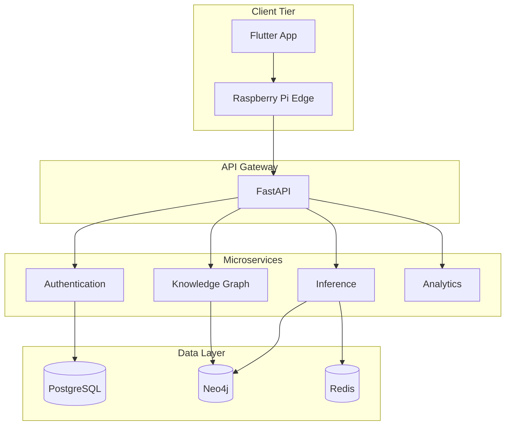

# MindGraph++ (SecureGraph-MultiDep)

[](LICENSE)
[](https://www.python.org/)
[](https://flutter.dev/)

**Privacy-preserving multilingual multimodal longitudinal depression intelligence platform** combining temporal knowledge graphs, graph neural networks, edge AI, explainable AI, and SDN-secured cloud orchestration.

> **Clinical disclaimer:** MindGraph++ is a wellness screening assistant. It does **not** provide medical diagnosis or replace licensed mental health professionals. All predictions are probabilistic.

---

## Project Overview

MindGraph++ assists voluntary mental wellness check-ins through:

- Multimodal analysis (voice, video, text, image)
- Longitudinal risk tracking via Neo4j temporal knowledge graphs
- Explainable predictions with modality and graph attribution
- On-device feature extraction with encrypted embedding upload
- Differential privacy and federated-learning-ready interfaces
- SDN-based secure healthcare traffic engineering (research)

---

## Architecture



---

## Technology Stack

| Layer | Technologies |
|-------|--------------|
| Mobile | Flutter, Riverpod, GoRouter, Freezed |
| Backend | FastAPI, Pydantic, SQLAlchemy, Celery |
| ML | PyTorch, Transformers, Librosa, MediaPipe, ONNX |
| Graph | Neo4j Community, PyTorch Geometric |
| Data | PostgreSQL, Redis, MinIO |
| Infra | Docker Compose, Makefile |
| Research | Mininet, Ryu SDN Controller |

---

## Research Motivation

Existing depression detection systems typically classify single sessions, ignore temporal evolution, lack privacy guarantees, and rarely support Indian multilingual users. MindGraph++ unifies temporal KG reasoning, multimodal fusion, edge inference, and secure networking in one reproducible platform.

---

## Novel Contributions

1. **Temporal User Knowledge Graph** — evolving per-user graphs across sessions
2. **Graph-based Depression Progression Modeling** — transition modeling vs static scores
3. **Privacy-Preserving Edge AI** — local extraction, embedding-only sync
4. **Multilingual Mental Health AI** — English, Tamil, Hindi, Tanglish, Romanized Tamil
5. **Explainable Graph Reasoning** — paths, SHAP, modality attribution
6. **Hybrid Cloud–Edge Inference** — phone → Pi → cloud
7. **SDN-Secured Healthcare Communication** — QoS and traffic isolation
8. **Zero-Cost Deployment Path** — community editions and open tooling

---

## Installation

### Prerequisites

- Git, Python 3.11+, Flutter (stable), Docker Desktop
- JDK 21 (Android), Node.js LTS (tooling)
- FFmpeg, Graphviz (optional: CUDA, Mininet on Ubuntu)

### Quick Start

```bash
# Clone
git clone <repository-url>
cd ieee-final-dep

# Automated setup (choose your OS)
./scripts/setup.sh          # Linux / WSL2
./scripts/setup_mac.sh      # macOS
./scripts/setup.ps1         # Windows

# Or via Makefile
make install
make docker
make run
```

Copy `.env.example` to `.env` and update secrets before production use.

---

## Folder Structure

```
├── backend/          # FastAPI microservices
├── flutter_app/      # Mobile client
├── ml_pipeline/      # Training, extraction, deployment
├── configs/          # Environment YAML configuration
├── graphs/           # Neo4j migrations and seeds
├── datasets/         # Dataset adapters (not raw data)
├── experiments/      # Reproducible experiment manifests
├── deployment/       # Production deployment manifests
├── docker-compose.yml
├── docs/             # System documentation
├── monitoring/       # Observability configs
├── benchmarking/     # Performance suites
├── scripts/          # Setup and utility scripts
└── tests/            # Cross-cutting tests
```

---

## Running Instructions

```bash
# Start infrastructure
make docker

# Backend API (http://localhost:8000)
make backend

# Flutter app
make flutter

# Run tests
make test

# Lint and format
make lint
make format
```

API documentation: `http://localhost:8000/docs`

---

## Screenshots

<!-- Placeholder: add screenshots to docs/images/ after UI implementation -->

| Screen | Path |
|--------|------|
| Home | `docs/images/home.png` |
| Record | `docs/images/record.png` |
| Results | `docs/images/results.png` |

---

## Dataset Instructions

Primary dataset: **DAIC-WOZ** (Distress Analysis Interview Corpus).  
Secondary: **D-VLOG**.

1. Obtain dataset licenses from official sources.
2. Place raw data under `datasets/raw/` (gitignored).
3. Run preprocessing via `ml_pipeline/datasets/` adapters.
4. See `datasets/README.md` for per-dataset instructions.

Never commit raw patient data or credentials.

---

## Citation

```bibtex
@software{mindgraphpp2026,
  title={MindGraph++: Privacy-Preserving Multilingual Multimodal Longitudinal Depression Intelligence},
  author={MindGraph++ Contributors},
  year={2026},
  url={https://github.com/your-org/mindgraph-plus-plus}
}
```

---

## License

Apache License 2.0 — see [LICENSE](LICENSE).

---

## Acknowledgements

- DAIC-WOZ, D-VLOG dataset authors
- Neo4j, PyTorch, Hugging Face open-source communities

---

## Roadmap

- [x] Repository foundation and development environment
- [ ] Backend services (auth, inference, knowledge graph)
- [ ] Flutter UI design system and core screens
- [ ] Multimodal ML pipeline and fusion models
- [ ] Neo4j temporal schema and GNN integration
- [ ] SDN research demonstration
- [ ] Publication experiments and ablation studies

---

## Contributing

See [CONTRIBUTING.md](CONTRIBUTING.md), [CODE_OF_CONDUCT.md](CODE_OF_CONDUCT.md), and [SECURITY.md](SECURITY.md).

Development standards: [docs/development_standards.md](docs/development_standards.md).
