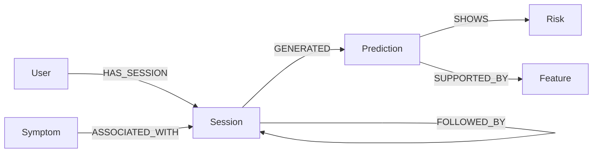

# Neo4j Graph Schema Diagram

See `graphs/migrations/001_schema.cypher` for constraints.

```mermaid
flowchart LR
    User -->|HAS_SESSION| Session
    Session -->|GENERATED| Prediction
    Prediction -->|SHOWS| Risk
    Prediction -->|SUPPORTED_BY| Feature
    Session -->|FOLLOWED_BY| Session
    Symptom -->|ASSOCIATED_WITH| Session
```

Full schema: Master Prompt 0 Part 3.
