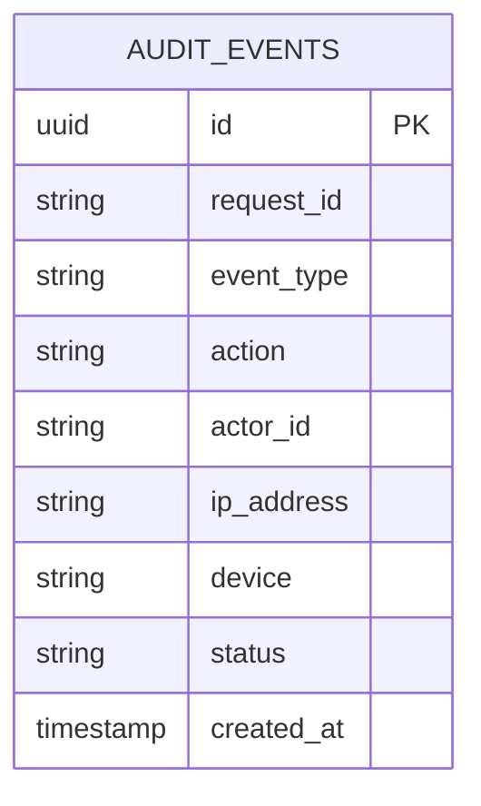

# PostgreSQL ER Diagram

> Generated when authentication and user modules are implemented.

## Planned Entities

- `users` — accounts and profile metadata
- `audit_events` — security audit trail (implemented)
- `consent_records` — per-modality consent
- `sessions` — wellness check-in metadata
- `notification_preferences` — user settings

## Current

